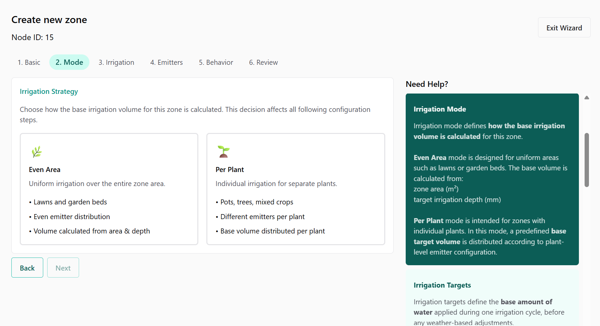
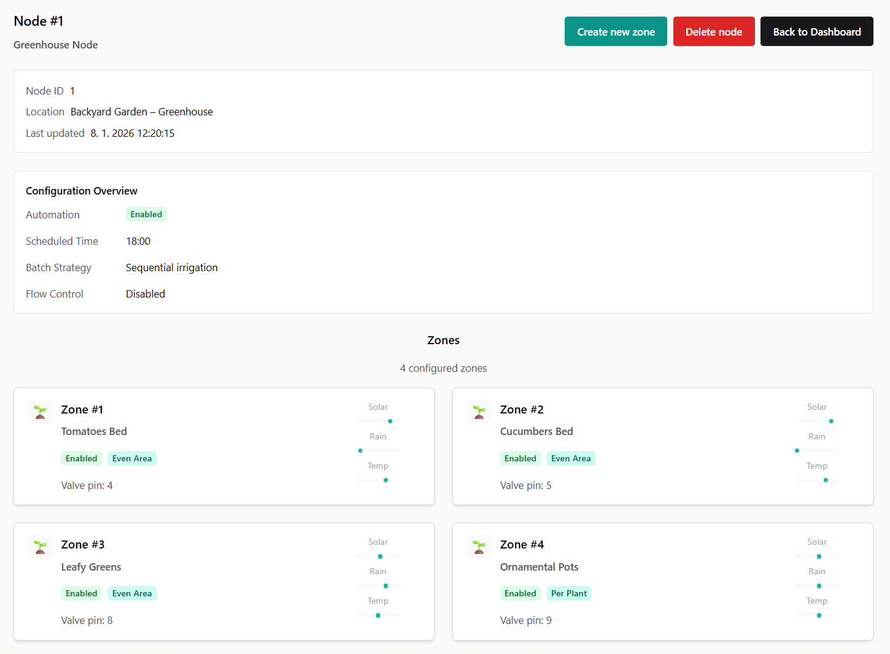
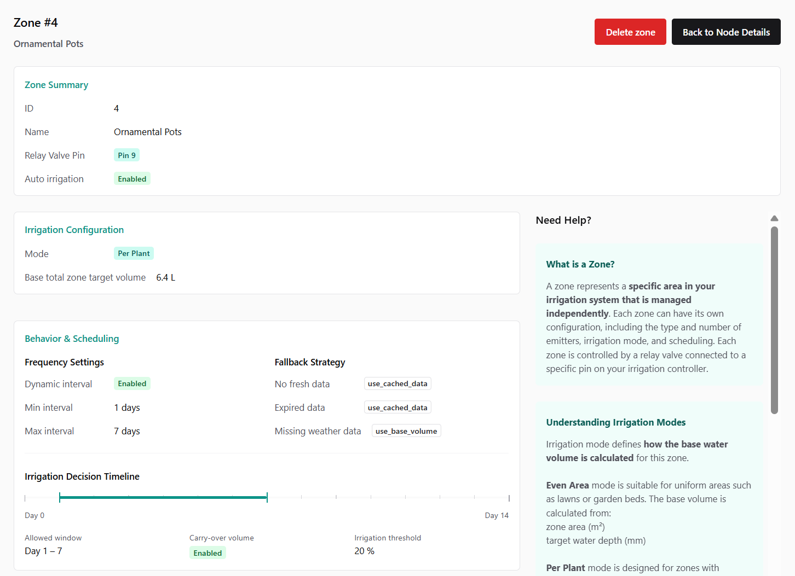
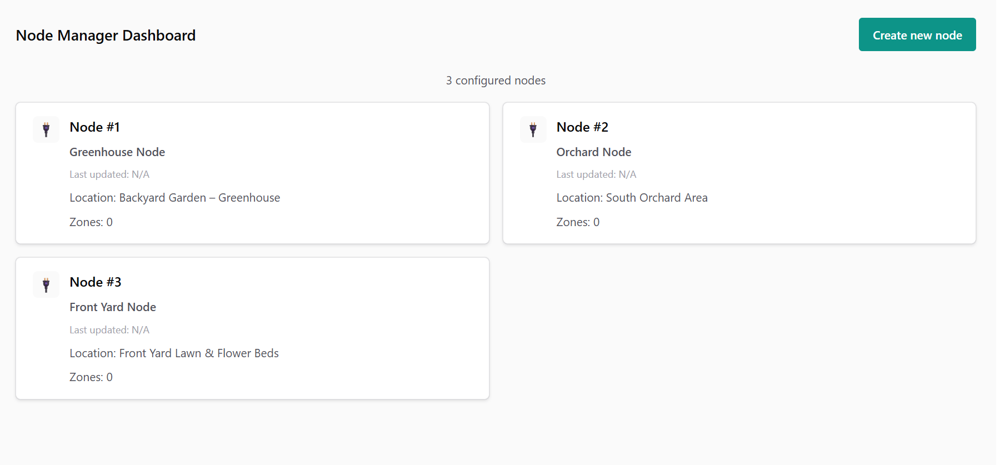
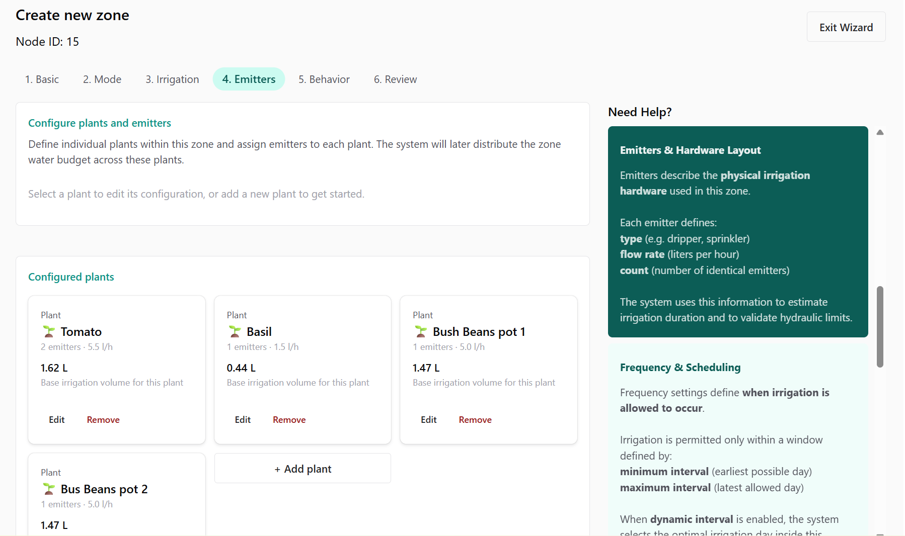

# Node Manager

**Node Manager** is a full-stack web application for designing, validating, and exporting configuration of irrigation nodes for the **Smart Irrigation System**.

It serves as a **configuration & planning layer**, sitting outside the runtime system, and provides user-friendly way to manage complex irrigation logic.

---

## What problem does Node Manager solve?

Smart Irrigation System requires complex configuration including:
- hardware constraints,
- environmental data (weather),
- domain rules (watering strategies, limits, fallbacks),
- and non-trivial configuration structures.

**Node Manager transforms this complexity into a structured visual workflow**:
- users design irrigation logic via UI,
- the backend validates and stores configurations,
- final outputs are exported as deterministic, SIS-compatible configuration files.

---

## Key capabilities

### Node & Zone configuration
- Create and manage **irrigation nodes** (physical controllers)
- Configure **zones** (individual irrigation circuits / valves)
- Clear separation between node-level and zone-level logic

### Multi-step Zone Configuration Wizard
- Guided, validated flow instead of overwhelming forms
- Contextual explanations and visual feedback
- Supports complex domain logic while remaining user-friendly

### Multiple irrigation strategies
Each zone operates in one of two modes:

#### `even_area`
- Uniform irrigation of an area (lawns, beds)
- Inputs:
  - area (m²)
  - target irrigation depth (mm)
- Base water volume is derived deterministically

#### `per_plant`
- Individual plants with dedicated emitters
- Supports mixed emitter types:
  - drippers
  - micro sprays
  - soaker hoses
- Water is distributed proportionally across plants
- Designed for future optimization logic

### Behavior & decision modeling
- Dynamic or fixed irrigation intervals
- Minimum / maximum spacing between irrigations
- Carry-over of skipped irrigation volume
- Volume thresholds to avoid micro-cycles
- Visual **Irrigation Decision Timeline** for clarity

### Weather awareness & resilience
- Local correction factors:
  - solar radiation
  - rain
  - temperature
- Explicit fallback strategies when weather data is:
  - unavailable
  - outdated

---

## Relationship to Smart Irrigation System (SIS)

**Smart Irrigation System (SIS)** is a distributed IoT platform consisting of:

- **Edge Nodes**
  - Raspberry Pi–based controllers
  - Autonomous, fault-tolerant irrigation logic
- **Central Services**
  - Weather data ingestion
  - Monitoring and orchestration
- **Runtime Web UI**
  - Status and telemetry

**Node Manager is not part of the runtime path**

Instead, it acts as *a configuration compiler and planning tool   producing validated inputs for SIS execution*.

---

## Architecture overview

### Backend
- **FastAPI**
- **SQLModel** (SQLAlchemy + Pydantic)
- **SQLite** (MVP)

Design principles:
- clean architecture
- explicit validation rules
- service & repository layers

Core layers:
- routers – REST API
- services – domain logic
- repositories – persistence
- schemas – API contracts
- exporters – SIS config generation

### Frontend
- **React**
- **Chakra UI (v3)**

Focus:
- clarity over complexity
- domain-driven UX
- consistent visual language
- full end-to-end flow:
  configuration → validation → export

<table width="100%" bgcolor="#ffffff">
  <tr>
    <td align="center">
      

        
        
      

      

        
        
      

    </td>
  </tr>
</table>

---

## Domain concepts (high level)

### Node
Represents a **physical irrigation controller**.

Includes:
- identity & metadata
- automation strategy
- irrigation limits
- batch behavior
- collection of zones

Acts as the **aggregate root** of the domain.

### Zone
Represents a **single irrigation circuit**.

- always belongs to exactly one node
- defines:
  - irrigation mode
  - water volume logic
  - frequency & behavior
  - emitter configuration

---

## Validation philosophy

Node Manager enforces:
- structural correctness (schemas)
- domain consistency (mode ↔ configuration)
- explicit separation of responsibilities

Invalid or contradictory configurations are rejected early,
before they ever reach the runtime system.

---

## Project Status

Table below summarizes the current status of key features:
| Milestone                     | Version | Status       | Description                                      |
|-------------------------------|---------|--------------|--------------------------------------------------|
| Initial project setup         | 0.1.0   | **Completed**    | Basic project skeleton and schema definitions    |
| Backend MVP                  | 0.2.0   | **Completed**    | REST API, Node & Zone management, config export  |
| Frontend MVP                 | 0.5.0   | **Completed**    | React UI, routing, Zone Configuration Wizard     |
| Containerization & Deployment    | 0.6.0   | *Planned*      | Docker setup, deployment scripts                  |

---

## License

MIT License  
© 2025 Lukáš Soják
